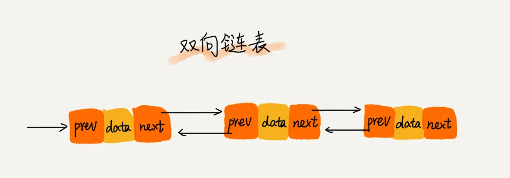

### 如何抓住重点，系统高效地学习数据结构与算法
#### 什么是数据结构？什么是算法？数据结构与算法的关系？
1. 数据结构是一组数据的存储结构。
2. 算法是操作数据的一组方法。
3. 二者的关系：数据结构是为算法服务的，算法作用于特定的数据结构之上。数据结构是静态的，必须基于它操作和构建算法，数据结构才有有意义。

#### 数据结构与算法的重点
1. 复杂度分析
2. 10种经典的数据结构和10种算法
  + 数组、链表、栈、队列、散列表、二叉树、堆、跳表、图、Trie树
  + 递归、排序、二分查找、搜索、哈希算法、贪心算法、分治算法、回溯算法、动态规划、字符串匹配算法
  
#### 如何学习
1. 多实践，适度刷题
2. 多问、多思考、多互动
3. 打怪升级学习法
4. 沉淀积累法

### 复杂度分析
复杂度分析是整个算法学习的精髓，只要掌握了它，数据结构和算法的内容基本就掌握了一半。
+ 复杂度描述的是算法执行时间或占用空间与数据规模的增长的关系。

#### 大O复杂度表示法
所有代码的执行时间T(n)与每行代码的执行次数f(n)成正比。
```
  T(n) = O(f(n))
```
大O时间复杂度实际上并不具备表示代码的真正的执行时间，而是表示代码执行时间随数据规模增长的变化趋势，因此也叫做渐进时间复杂度(asymptotic time complexity)，简称时间复杂度。

#### 时间复杂度分析、
时间复杂度的全称是渐进时间复杂度，表示算法的执行时间与数据规模之间的增长关系。
1. 只关注执行次数最多的一段代码
2. 加法法则：总复杂度等于量级最大的那段代码复杂度
```
  T(n) = T1(n) + T2(n) = O(max(f(n),g(n)))
```
3. 乘法法则：嵌套代码的复杂度等于嵌套内外代码复杂度的乘积
```
  T(n) = T1(n) * T2(n) = O(f(n)*g(n))
```

#### 几种常见时间复杂度实例分析
复杂度量级分类
 + 常量阶O(1)
 + 对数阶O(logn)
 + 线性阶O(n)
 + 线性对数阶O(nlogn)
 + 平方阶O(n*2)、立方阶O(n3)
 + 指数阶O(2*n)
 + 阶乘阶O(n!)

#### 空间复杂度分析
空间复杂度全称就是渐进空间复杂度，表示算法的存储空间与数据规模之间的增长关系。

#### 常见空间复杂度
 + O(1)
 + O(n)
 + O(n*2)

#### 为什么要进行复杂度分析？
1. 和性能测试相比，复杂度分析有不依赖执行环境、成本低、效率高、易操作、指导性强的特点。
2. 掌握复杂度分析，将能编写出性能更优的代码，有利于降低系统开发和维护成本。
   
### 时间复杂度分析种类
#### 1. 最好情况时间复杂度
最好情况时间复杂度：在最理想的情况下，执行这段代码的时间复杂度。
#### 2. 最坏情况时间复杂度
最坏情况时间复杂度：在最糟糕的情况下，执行这段代码的时间复杂度。
#### 3. 平均情况时间复杂度
平均情况时间复杂度：加权平均时间复杂度或者期望时间复杂度
#### 4. 均摊时间复杂度
均摊时间复杂度：如果大多情况下是低级别的复杂度，极少数情况是高级别复杂度，可以将高级别复杂度均摊到低级别复杂度上。

### 数组：为什么多数编程语言中数组都是从0开始编号
#### 什么是数组
数组是一种线性表数据结构。它用一组连续的内存空间，来存储一组具有相同类型的数据。
#### 数组是如何实现随机访问
数据具有两个特性。
1. 数组是线性表
2. 数组是连续的存储空间并存储相同类型的数据。
数组中第i个元素的地址
```
  a[i]_address = base_address + i * data_type_size
```
#### 数组低效的“插入”和“删除”操作
数组“插入”和“删除”操作的平均时间复杂度为O(n)

### 链表
#### 单链表

+ 第一个结点叫头结点，最后一个结点叫尾结点

#### 双向链表

+ 每个结点不止有后继指针next指向后面的结点，也有一个前驱指针prev指向前面的结点
#### 循环链表

+ 尾结点指针指向头结点

#### 写链表代码的技巧
+ 理解指针或引用的含义
指针或引用存储的变量的内存地址，指向了这个变量
+ 警惕指针丢失和内存泄漏
+ 利用哨兵简化实现难度
+ 重点留意边界条件处理
+ 距离画图，辅助思考
+ 多练多谢，没有捷径
  
#### 常见的链表操作
+ 单链表反转
+ 链表中环的检测
+ 两个有序的链表合并
+ 删除链表倒数第n个结点
+ 求链表的中间结点

### 栈
#### 栈的理解
1. 栈的结构特点，后进先出，先进后出。
2. 栈是一种“操作受限”的线性表，只允许在一端插入和删除数据。
   
#### 数组实现顺序栈
```javascript
  class ArrayStack {
    constructor() {
      this.items = []
    }
    push(item) {
      this.items.push(item)
    }
    pop() {
      return this.items.pop()
    }
    clear() {
      this.items = []
    }
   }
```
#### 栈在表达式求值中的应用


#### 入栈、出栈的时间复杂度
入栈或出栈的时间复杂度都是O(1)

### 队列
#### 队列的理解
1. 先进者先出
2. 队列的基本操作：入队和出队
   
#### 数组实现队列
```javascript
  class ArrayQueue {
    constructor() {
      this.items = []
    }
    enqueue(item) {
      this.items.push(item)
    }
    dequeue() {
      return this.items.shift()
    }
  }
```

#### 基于链表实现队列

#### 循环队列

循环队列中队空和队满的判定条件
1. 队空条件 head == tail
2. 队满条件 (tail+1) % n == head

```javascript
  class CircleQueue {
    constructor(n) {
      this.items = new Array(n)
      // 循环队列的长度
      this.n = n
      // 队头指针
      this.head = 0
      // 队尾指针
      this.trail = 0
    }

    enqueue(item) {
      // 队列满了无法入队
      if ((this.trail + 1) % 1 === this.head) return false
      this.items[this.trail] = item
      this.trail = (this.trail + 1) % n
      return true
    }

    dequeue() {
      // 队空返回
      if (this.tail === this.head) return null
      const temp = this.item[this.head]
      this.head = (this.head + 1) % n
      return temp
    }
  }
```
#### 阻塞队列、并发队列
+ 阻塞队列就是入队、出队操作可以阻塞
+ 并发队列就是队列的操作多线程安全