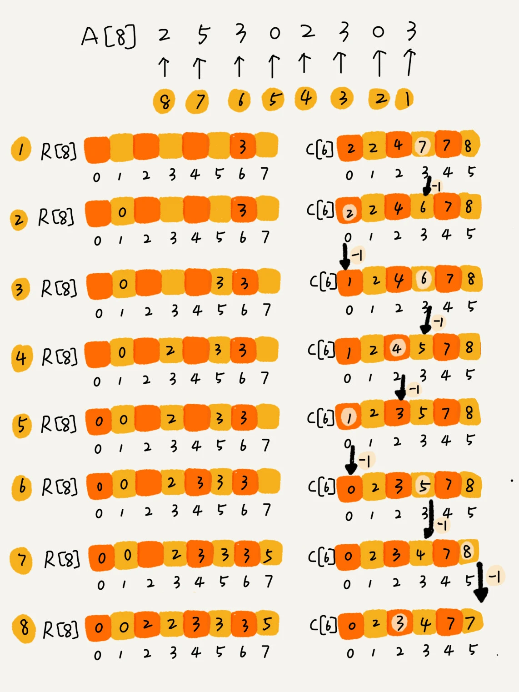
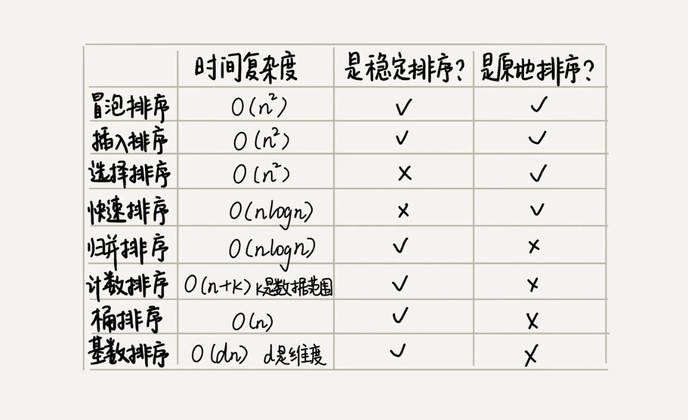
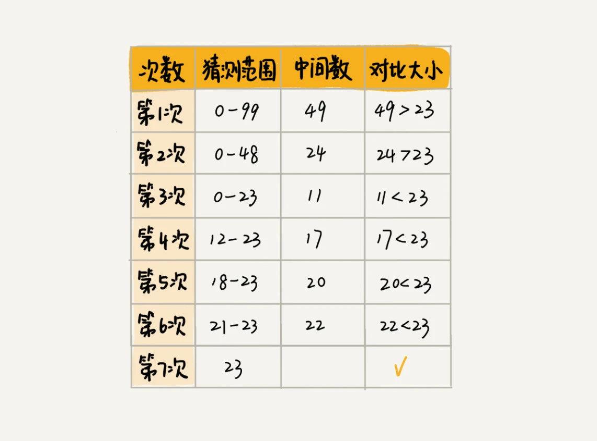
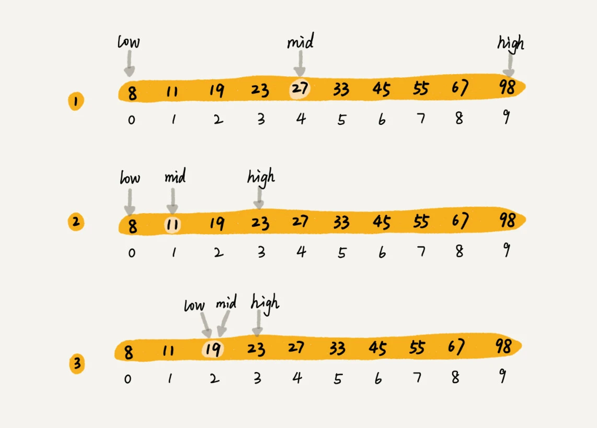

### 如何抓住重点，系统高效地学习数据结构与算法
#### 什么是数据结构？什么是算法？数据结构与算法的关系？
1. 数据结构是一组数据的存储结构。
2. 算法是操作数据的一组方法。
3. 二者的关系：数据结构是为算法服务的，算法作用于特定的数据结构之上。数据结构是静态的，必须基于它操作和构建算法，数据结构才有有意义。

#### 数据结构与算法的重点
1. 复杂度分析
2. 10种经典的数据结构和10种算法
  + 数组、链表、栈、队列、散列表、二叉树、堆、跳表、图、Trie树
  + 递归、排序、二分查找、搜索、哈希算法、贪心算法、分治算法、回溯算法、动态规划、字符串匹配算法
  
#### 如何学习
1. 多实践，适度刷题
2. 多问、多思考、多互动
3. 打怪升级学习法
4. 沉淀积累法

### 复杂度分析
复杂度分析是整个算法学习的精髓，只要掌握了它，数据结构和算法的内容基本就掌握了一半。
+ 复杂度描述的是算法执行时间或占用空间与数据规模的增长的关系。

#### 大O复杂度表示法
所有代码的执行时间T(n)与每行代码的执行次数f(n)成正比。
```
  T(n) = O(f(n))
```
大O时间复杂度实际上并不具备表示代码的真正的执行时间，而是表示代码执行时间随数据规模增长的变化趋势，因此也叫做渐进时间复杂度(asymptotic time complexity)，简称时间复杂度。

#### 时间复杂度分析、
时间复杂度的全称是渐进时间复杂度，表示算法的执行时间与数据规模之间的增长关系。
1. 只关注执行次数最多的一段代码
2. 加法法则：总复杂度等于量级最大的那段代码复杂度
```
  T(n) = T1(n) + T2(n) = O(max(f(n),g(n)))
```
3. 乘法法则：嵌套代码的复杂度等于嵌套内外代码复杂度的乘积
```
  T(n) = T1(n) * T2(n) = O(f(n)*g(n))
```

#### 几种常见时间复杂度实例分析
复杂度量级分类
 + 常量阶O(1)
 + 对数阶O(logn)
 + 线性阶O(n)
 + 线性对数阶O(nlogn)
 + 平方阶O(n*2)、立方阶O(n3)
 + 指数阶O(2*n)
 + 阶乘阶O(n!)

#### 空间复杂度分析
空间复杂度全称就是渐进空间复杂度，表示算法的存储空间与数据规模之间的增长关系。

#### 常见空间复杂度
 + O(1)
 + O(n)
 + O(n*2)

#### 为什么要进行复杂度分析？
1. 和性能测试相比，复杂度分析有不依赖执行环境、成本低、效率高、易操作、指导性强的特点。
2. 掌握复杂度分析，将能编写出性能更优的代码，有利于降低系统开发和维护成本。
   
### 时间复杂度分析种类
#### 1. 最好情况时间复杂度
最好情况时间复杂度：在最理想的情况下，执行这段代码的时间复杂度。
#### 2. 最坏情况时间复杂度
最坏情况时间复杂度：在最糟糕的情况下，执行这段代码的时间复杂度。
#### 3. 平均情况时间复杂度
平均情况时间复杂度：加权平均时间复杂度或者期望时间复杂度
#### 4. 均摊时间复杂度
均摊时间复杂度：如果大多情况下是低级别的复杂度，极少数情况是高级别复杂度，可以将高级别复杂度均摊到低级别复杂度上。

### 数组：为什么多数编程语言中数组都是从0开始编号
#### 什么是数组
数组是一种线性表数据结构。它用一组连续的内存空间，来存储一组具有相同类型的数据。
#### 数组是如何实现随机访问
数据具有两个特性。
1. 数组是线性表
2. 数组是连续的存储空间并存储相同类型的数据。
数组中第i个元素的地址
```
  a[i]_address = base_address + i * data_type_size
```
#### 数组低效的“插入”和“删除”操作
数组“插入”和“删除”操作的平均时间复杂度为O(n)

### 链表
#### 单链表

+ 第一个结点叫头结点，最后一个结点叫尾结点

#### 双向链表

+ 每个结点不止有后继指针next指向后面的结点，也有一个前驱指针prev指向前面的结点
#### 循环链表

+ 尾结点指针指向头结点

#### 写链表代码的技巧
+ 理解指针或引用的含义
指针或引用存储的变量的内存地址，指向了这个变量
+ 警惕指针丢失和内存泄漏
+ 利用哨兵简化实现难度
+ 重点留意边界条件处理
+ 距离画图，辅助思考
+ 多练多谢，没有捷径
  
#### 常见的链表操作
+ 单链表反转
+ 链表中环的检测
+ 两个有序的链表合并
+ 删除链表倒数第n个结点
+ 求链表的中间结点

### 栈
#### 栈的理解
1. 栈的结构特点，后进先出，先进后出。
2. 栈是一种“操作受限”的线性表，只允许在一端插入和删除数据。
   
#### 数组实现顺序栈
```javascript
  class ArrayStack {
    constructor() {
      this.items = []
    }
    push(item) {
      this.items.push(item)
    }
    pop() {
      return this.items.pop()
    }
    clear() {
      this.items = []
    }
   }
```
#### 栈在表达式求值中的应用


#### 入栈、出栈的时间复杂度
入栈或出栈的时间复杂度都是O(1)

### 队列
#### 队列的理解
1. 先进者先出
2. 队列的基本操作：入队和出队
   
#### 数组实现队列
```javascript
  class ArrayQueue {
    constructor() {
      this.items = []
    }
    enqueue(item) {
      this.items.push(item)
    }
    dequeue() {
      return this.items.shift()
    }
  }
```

#### 基于链表实现队列

#### 循环队列

循环队列中队空和队满的判定条件
1. 队空条件 head == tail
2. 队满条件 (tail+1) % n == head

```javascript
  class CircleQueue {
    constructor(n) {
      this.items = new Array(n)
      // 循环队列的长度
      this.n = n
      // 队头指针
      this.head = 0
      // 队尾指针
      this.trail = 0
    }

    enqueue(item) {
      // 队列满了无法入队
      if ((this.trail + 1) % 1 === this.head) return false
      this.items[this.trail] = item
      this.trail = (this.trail + 1) % n
      return true
    }

    dequeue() {
      // 队空返回
      if (this.tail === this.head) return null
      const temp = this.item[this.head]
      this.head = (this.head + 1) % n
      return temp
    }
  }
```
#### 阻塞队列、并发队列
+ 阻塞队列就是入队、出队操作可以阻塞
+ 并发队列就是队列的操作多线程安全

### 递归
#### 递归公式表示
```
f(n)=f(n-1)+1 其中，f(1)=1
```

#### 递归需要满足的三个条件
1. 一个问题的解可以分解为几个子问题的解
2. 这个问题与分解之后的子问题，除了数据规模不同，求解思路完全一样
3. 存在递归终止条件
   
#### 加入有一个n个台阶，每次你可以跨1个台阶或者2个台阶，请问走这n个台阶有多少种走法？
```javascript
 function f(n) {
   if (n === 1) return 1;
   if (n === 2) return 2;
   return f(n-1) + f(n-2);
 }

```
#### 递归的优缺点
优点： 
1. 递归代码非常简洁
   
缺点：
1. 空间复杂度高
2. 有堆栈溢出的风险
3. 存在重复调用
4. 过多的函数调用耗时较多

### 排序
#### 排序算法的比较

#### 如何分析一个“排序算法”
+ 排序算法的执行效率
  1. 最好情况、最坏情况、平均情况时间复杂度
  2. 时间复杂度的系数、常数、低阶
  3. 比较次数喝交换(或移动)次数

+ 排序算法的内存消耗
原地排序(Sorted in place)，特指空间复杂度是O(1)的排序算法。
+ 排序算法的稳定性
稳定性是指待排序的序列中存在值相等的元素，经过排序后顺序与未排序之前的先后顺序不变。

#### 冒泡排序(Bubble Sort)
冒泡排序只会操作相邻的两个数据。每次冒泡操作都会对相邻的两个元素进行比较，看是否满足大小关系要求。

```javascript
  function bubbleSort(array) {
    const n = array.length
    if (n <= 1) {
      return
    }

    for (let i = 0; i < n - 1; i++) {
      let flag = false
      for(let j = 0; j < n - i - 1; j++) {
        if(array[j] > array[j + 1]) {
          const temp = array[j]
          array[j] = array[j + 1]
          array[j + 1] = temp
          flag = true
        }
      }
      if (!flag) break;
    }
  }
```
外层循环控制内层循环的次数，内层循环控制未排序区的元素比较次数

#### 插入排序(Insertion Sort) 

将数组数据分为已排序区间和未排序区间，取未排序区间元素，在已排序区间中找到合适位置将其插入，并保证已排序区间数据一直有序。
```javascript
  function insertionSort(a) {
    const n = a.length
    if (n <= 1) {
      return
    }
    for(let i = 1; i < n; i++) {
      const value = a[i]
      let j = i - 1
      for(; j >= 0; j--) {
        if (a[j] > value) {
          a[j + 1] = a[j] //数据后移
        } else {
          break
        }
      }
      a[j + 1] = value
    }
  }
```
外层循环取未排序区间的元素，内层循环取已排序区间的元素，如果取的已排序元素大于取的未排序的元素，已排序元素后移并插入未排序元素。

#### 选择排序(Seletion Sort)
选择排序是一种不稳定的排序算法；选择排序也分为已排序区间和未排序区间，但每次会从未排序区间找到最小元素，将其放到已排序区间的末尾。

```javascript
  function selectionSort(array) {
    const n = array.length
    if (n <= 1) {
      return
    }
    for(let i = 0; i < n - 1; i++) {
      let minIndex = i
      let j = i + 1;
      for (; j < n ; j++) {
        if (array[minIndex] > array [j]) {
          minIndex = j
        }
      }
      const temp = array[i]
      array[i] = array[minIndex]
      array[minIndex] = temp
    }
  }
```
外层循环取未排序区间的初始索引，内层循环比较未排序区间的元素，取最小值的索引；将最小值与未排序区间的第一个元素交换位置。

#### 归并排序的原理(Merge Sort)
将数组从中间分成前后两部分，分成最小可比较数组单元，然后对数组单元进行排序，然后对排序好的数组进行合并。

```javascript
  function mergeSort(a) {
    const n = a.length
    if (n === 1) {
      return a
    }
    const mid = Math.floor(n/2)
    const leftA = a.slice(0,mid)
    const rightA = a.slice(mid,n)
    
    return merge(mergeSort(leftA),mergeSort(rightA))
  }
  function merge(leftA,rightA) {
    const temp = [];
    let i = 0;
    let j = 0;
    while(i < leftA.length && j < rightA.length) {
      if (leftA[i] <= rightA[j]) {
        temp.push(leftA[i++])
      } else {
        temp.push(rightA[j++])
      }
    }
    while(i < leftA.length) {
      temp.push(leftA[i++])
    }

    while(j < rightA.length) {
      temp.push(rightA[j++])
    }
    return temp
  }
```

#### 快速排序的原理(Quicksort)

数组中选择任意一个数作为分区点，将小于分区点的数放在左边，将大于分区点的放在右边，将分区点放在中间。
```javascript
  function quickSort(arr) {
    if (arr.length <= 1) {
      return arr
    }
    let left = []
    let right = []
    for(let i = 1; i < arr.length; i++) {
      if (arr[i] < arr[0]) {
        left.push(arr[i])
      } else {
        right.push(arr[i])
      }
    }
    left = quickSort(left)
    right = quickSort(right)
    left = [...left, arr[0]]
    return [...left,...right]
  }
```

#### 快速排序O(n)时间复杂度内找到无序数组中的第 K 大元素
```javascript
  function findKthLargest(arr,k) {
    if (arr.length <= 1) {
      return arr[0]
    }
    let left = []
    let right = []
    const pivot = arr[0]
    for(let i = 1; i < arr.length; i++) {
      if (arr[i] > pivot) {
        left.push(arr[i])
      } else {
        right.push(arr[i])
      }
    }
    // pivot的索引值
    const p = left.length 
    if (k - 1 === p) {
      return pivot
    } 
    if (k > p + 1) {
      k = k - p - 1
      return findKthLargest(right,k)
    } else {
      if (k > left.length) {
        k = k - left.length 
      }
      left = [...left,pivot]
      return findKthLargest(left,k)
    }
  }
```
### 线性排序
桶排序、计数排序、基数排序都是时间复杂度是O(n)的排序算法，复杂度是线性的，因此归类为线性排序(Linear sort)。
#### 桶排序(Bucket sort)

桶排序就是将要排序的数据分到几个有序的桶里，每个桶里的数据再单独进行排序。桶排序比较适合用在外部排序中。例如外部磁盘的数据排序。
#### 计数排序(Counting sort)

计数排序其实桶排序的一种特殊情况。当要排序的n个数据，所处的范围并不大的时候，比如最大值是k，我们就可以把数据划分成k个桶。
```javascript
  function countingSort(arr) {
    const n = arr.length
    if (n <= 1) {
      return arr
    }

    // 求数据中最大值
    var max = arr[0]
    for (let i = 1; i < n; i++) {
      if (max < arr[i]) {
        max = arr[i]
      }
    }

    let cArr = new Array(max + 1)
    cArr.fill(0)

    for (let i = 0; i < n; i++) {
      cArr[arr[i]]++
    }

    // 依次累加
    for (let i = 1; i <= max; i++) {
      cArr[i] = cArr[i - 1] + cArr[i]
    }

    // 临时数组temp，存储排序后的结果
    const temp = []
    for(let i = n - 1; i >= 0; i--) {
      let index = cArr[arr[i]] - 1
      temp[index] = arr[i]
      cArr[arr[i]]-- 
    }
    return temp
  }
```
#### 基数排序(Radix sort)
基数排序要对排序的数据有要求的，需要可以分割独立的“位”来比较，而且位之间有递进的关系，如果a数据的高位比b数据大，剩下低位就不用比较了。

#### 如何选择合适的排序算法?

1. 对于小规模数据进行排序，可以选择时间复杂度是O(n*2)的算法
2. 如果对大规模许局进行排序，可以选择时间复杂度是O(nlogn)的算法

#### 如何优化快速排序？
合理的分区可以提高时间复杂度，有几种常用的分区算法。
1. 三数取中法
2. 随机法

### 二分查找(Binary Search)
前提是有序集合的查找算法，对序列进行折半查找。二分查找可以用最省内存实现快速查找。

二分查找8，11，19，23，27，33，45，55，67，98有序序列的中数值19的过程

#### 二分查找的时间复杂度
如果数据大小是n，每次查找会缩小一半，因此最坏情况下查找区间变化n,n/2,n/4,n/8,...,n/2*k。其中n/2*k = 1,k=log(2n),因此时间复杂度O(logn)。
#### 最简单情况下实现二分查找
最简单情况是有序数组中不存在重复元素
```javascript
 function bsearch(a,value) {
   if (!Array.isArray(a)) {
     return
   }
   let low = 0;
   let high = a.length - 1

   while(low <= high) {
     let mid = Math.floor((low + high) / 2)
     if (a[mid] === value) {
       return mid
     }
     else if(a[mid] > value) {
       // 当中间数大于value,在0 ~ mid-1之间继续查找
       high = mid - 1
     } else {
       // 当中间数小于value,在mid+1 ~ high之间继续查找
       low = mid + 1
     }
   }
 }
```
#### 递归实现二分查找
```javascript
  
  function bsearch(a,value,low,high) {
    if (!Array.isArray(a)) {
      return
    }
    if (low > high) {
      return -1
    }
    let mid = low + ((high - low) >> 1)
    if (a[mid] === value) {
      return mid
    } else if(a[mid] > value) {
      high = mid - 1
      return bsearch(a,value,low,high)
    } else {
      low = mid + 1
      return bsearch(a,value,low,high)
    }
 }
```
#### 如何编程实现“求一个数的平方根”？要求精确到小数点后6位
```javascript
  function sqrt(x) {
    if (isNaN(x)) return NaN
    if (x === 0 || x === 1) {
      return x
    }
    let low = 0;
    let high = x;
    let pivot = (low + high)/2;
    let lastPivot = 0
    while(Math.abs(pivot - lastPivot) >= 0.000001) {
      if (Math.pow(pivot,2) > x) {
        high = pivot
      } else if(Math.pow(pivot,2) < x) {
        low = pivot
      } else {
        return pivot
      }
      lastPivot = pivot
      pivot = (low + high) / 2
    }
    return pivot
  }
```

#### 二分查找如果使用链表存储的时间复杂度究竟是多少？
总的指针移动次数(查找次数) = n/2 + n/4 + n/8 + ... + 1,等比数列求和Sum = n - 1;因此时间复杂度O(n)。

### 常见的二分查找变形问题

#### 在有序数组中查找第一个值等于给定值的元素

```javascript
  function bsearch(a,value) {
    let low = 0,high = a.length - 1
    while(low <= high) {
      let mid = low + ((high - low) >> 1)
      if (a[mid] > value) {
        high = mid - 1
      } else if(a[mid] < value) {
        low = mid + 1
      } else {
        if (mid === 0 || a[mid - 1] !== value) return mid
        else high = mid - 1
      }
    }

    return -1
  }
```

#### 在有序数组中查找最后一个值等于给定值的元素
```javascript
  function bsearch(a,value) {
    let n = a.length - 1
    let low = 0,high = n
    while(low <= high) {
      let mid = low + ((high - low) >> 1)
      if (a[mid] > value) {
        high = mid - 1
      } else if (a[mid] < value){
        low = mid + 1
      } else {
        if ((mid === n - 1) || (a[mid + 1] != value)) return mid
        else low = mid + 1
      }
    }

    return -1
  }
```

#### 在有序数组中查找第一个大于等于给定值的元素
```javascript
  function bsearch(a,value) {
    let low = 0,high = a.length - 1
    while(low <= high)  {
      let mid = low + ((high - low) >> 1)
      if (a[mid] >= value) {
        if (mid === 0 || a[mid - 1] < value) return mid
        else high = mid - 1
      } else {
        low = mid + 1
      }
    }
    return -1
  }
```

#### 在有序数组中查找最后一个小于等于给定值的元素
```javascript
  function bsearch(a,value) {
    let n = a.length - 1
    let low = 0, high = n
    while(low <= high) {
      let mid = low + ((high - low) >> 1)
      if (a[mid] > value) {
        high = mid - 1
      } else {
        if (mid === n || a[mid + 1] > value) return mid
        else low = mid + 1
      }
    }
    return -1
  }
```

