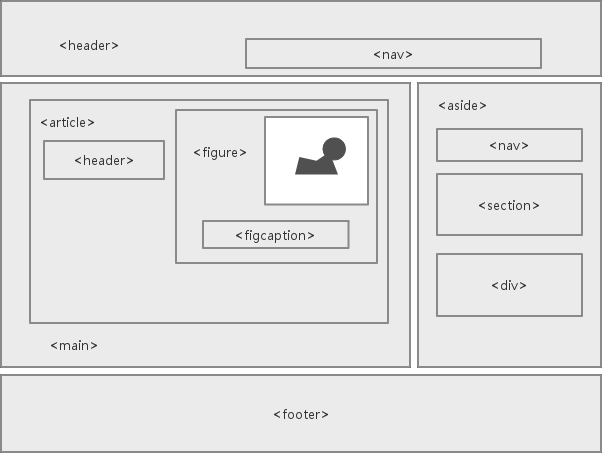

## HTML基础

### 什么是HTML？
HTML是用来描述网页的一种标记语言。
	+ HTML指的是超文本标记语言(Hyper Text Markup Language)
	+ HTML不是一种编程语言，是一种标记语言(markup language)
	+ 标记语言是一套标记标签(markup tag)
	+ HTML使用标记标签来描述网页

### HTML标签
HTML标记标签通常被称为HTML标签(HTML tag)
  + HTML标签是由尖括号包围的关键词，如<html>
	+ HTML标签通常是成对出现的，比如<b>和</b>
	+ 标签对中，第一个标签是开始标签，第二个标签是结束标签
	+ 开始和结束标签被称为开放标签和闭合标签

### HTML文档
  + HTML文档描述网页
	+ HTML文档包含HTML标签和纯文本
	+ HTML文档被称为网页

### HTML标题标签
  + <h1> - <h6>
	```html
	<h1>一级标题</h1>
	<h2>二级标题</h2>
	```

### HTML段落标签
	由<p></p>标签对进行定义
	```html
		<p>这是一个段落</p>
	```

### HTML折行
	<br />标签可以进行换行
	```html
		<p>This is <br/> a para<br />graph with line breaks</p>
	```

### HTML链接标签
	html使用超级链接与网络上的另一个文档相连。由<a></a>标签对进行定义
	```html
		<a href="http://www.w3school.com.cn">This is a link.</a>
	```
	超链接的两种使用方式：
		+ 1. 通过使用href属性 - 创建指向另一个文档的链接
	```html
		<a href="http://www.w3school.com.cn/">Visit W3School</a>
	```
		+ 2. 通过使用name属性,规定锚点的名称 - 创建文档内的书签
	```html
		<!-- 定义锚点-->
		<a name="tips">基本的注意事项 - 有用的提示</a>
		<!-- 指向锚点的链接 -->
		<a href="#tips">有用的提示</a>
	```

		+ a标签的target属性，表示链接的网页在何处显示
	```html
		<a href="http://www.w3school.com.cn/" target="_blank">Visit W3School</a>
	```

### HTML表格
	+ <table>
	+ <caption>
	+ <th> 
	+ <tr>
	+ <td>
	+ <thead>
	+ <tbody>
	+ <tfoot>

### HTML图像
	由标签进行定义
	+ src源属性:源属性的值是图像的URL地址
	+ alt替换文本属性:一串预备的可替换的文本
  ```html
		
	```

### HTML元素
	HTML元素由HTML元素定义，由开始标签(start tag)到结束标签(end)的所有内容。
	+ HTML元素以开始标签起始
	+ HTML元素以结束标签终止
	+ 元素的内容是开始标签与结束标签之间的内容
	+ 某些HTML元素具有空内容
	+ 空元素在开始标签进行关闭
	+ HTML元素可拥有属性

### HTML属性
	属性为HTML元素提供附加信息。
	HTML标签可以拥有属性。属性提供了有关HTML元素的更多的信息。

### HTML水平线
	<hr />标签在HTML网页中创建水平线，用于分隔内容。
	```
		<p>This is a paragraph</p>
		<hr />
		<p>This is a paragraph</p>
		<hr />
		<p>This is a paragraph</p>
	```

### HTML注释
	```html
		<!-- This is a comment -->
	```

### HTML样式
	style属性用于改变HTML元素的样式。
	```html
		<html>
			<body style="background-color:yellow">
				<h2 style="background-color:red">This is a heading</h2>
				<p style="background-color:green">This is a paragraph</p>
			</body>
		</html>
	```
### HTML文本格式化
	文本格式化标签。
	+ <b> 定义粗体文本
	+ <big> 定义大号字体
	+ <em> 定义着重文字
	+ <i> 定义斜体字
	+ <small> 定义小号字
	+ <sub> 定义下标
	+ <sup> 定义上标
	+ <ins> 定义插入字
	+ <del> 定义删除字

### HTML引用
	HTML<q>元素定义短的引用。
	```html
		<p>WWF的目标是：<q>构建人与自然和谐共存的世界。</q></p>
	```
	HTML<blockquote>元素定义长的引用。
	```html
		<p>以下内容引用自WWF的网站:</p>
		<blockquote cite="http://www.worldwildlife.org/who/index.html>
		五十年来，WWF一直致力于保护自然界的未来。
		世界领先的环保组织，WWF 工作于 100 个国家，
		并得到美国一百二十万会员及全球近五百万会员的支持。
		</blockquote>
	```
	HTML<abbr>元素用于定义缩写或者首字母缩略语。
	```html
		<p>
			<abbr title="World Health Organization">WHO</abbr>成立于1948年
		</p>
	```
	HTML<dfn>元素定义项目或缩写的定义。
	```html
		<p>
			<dfn>
				<abbr title="World Health Organization">WHO</abbr>成立于1948年
			</dfn>
		</p>
	```
	HTML<address>元素定义文档或文章的联系信息
	```html
		<address>
		Written by Donald Duck.<br/>
		Visit us at:<br/>
		Example.com<br/>
		Box 564, Disneyland<br/>
		USA
		</address>
	```
	HTML<cite>元素定义著作的标题
	```html
		<p>
			<cite>The Scream</cite> by Edward Munch. Painted in 1893.</p>
		</p>
	```

### HTML CSS
	+ 外部样式表
	```html
		<head>
			<link rel="stylesheet" type="text/css" href="mystyle.css">
		</head>
	```
	+ 内部样式表
	```html
		<head>
			<style type="text/css">
				body {
					background-color: red;
				}
				p {
					margin-left: 20px;
				}
			</style>
		</head>
	```
	+ 内联样式
	```html
		<p style="color:red;margin-left:20px">
			This is a paragraph.
		</p>
	```
## 页面结构语义化

### 为什么需要语义化

+ 易修改、易维护
+ 无障碍阅读支持
+ 搜索引擎友好，利于SEO
+ 面向未来的HTML，浏览器在未来可能提供更丰富的支持

### 结构语义化

结构语义化：仅是语义元素在页面结构的规范化



#### header(头部)

header元素的两种用法：

+ 标注内容的标题
+ 标注网页的页眉

#### nav(导航栏)

导航通常包含一组链接

```html
<nav>
	<ul>
		<li><a href="#" title="链接"></a></li>
		<li><a href="#" title="链接"></a></li>
		<li><a href="#" title="链接"></a></li>
	</ul>
</nav>
```

#### aside(附注)

aside元素不仅是侧栏，也可以用来说明文章的附加内容、解释某个观点等。

#### footer(页脚)

footer标签仅仅可以包含版权信息、来源信息、法律限制等之类的文本或链接信息。

#### main主要内容

